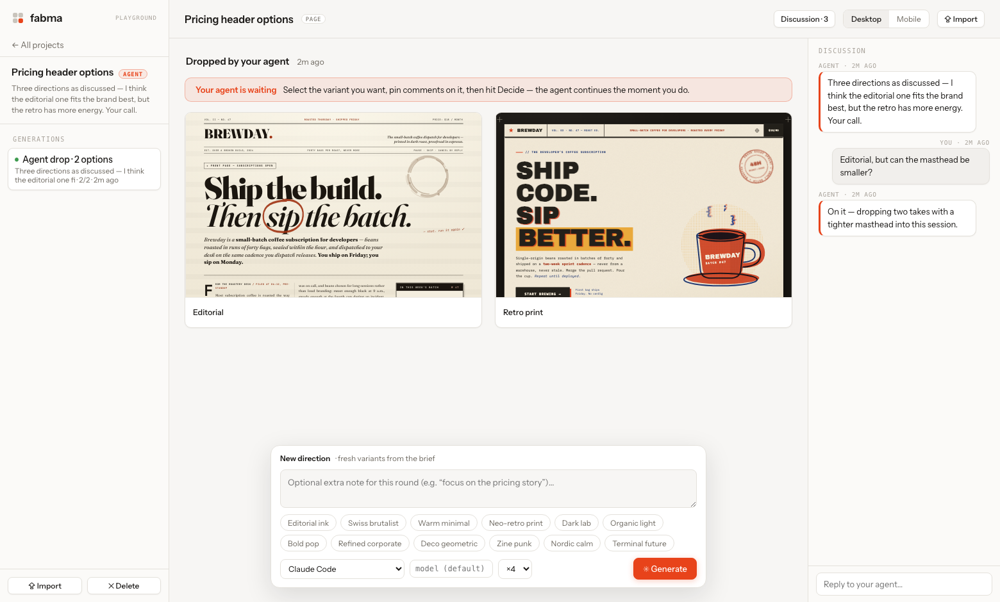

<p align="center"></p>

**Fabma is a local, open-source design playground for working with AI the way AI actually works.** A brief goes in; competing art directions come out — real, rendered, self-contained HTML. You pick one, pin comments on it, refine. Then export clean HTML, an **Elementor template** for WordPress, or **SVG you paste straight into Figma**.

It runs on the **Claude Code or Codex subscription you already have** — fabma spawns your logged-in `claude` / `codex` CLI per variant. No API keys, no cloud, no accounts. Your designs are plain files on your disk.

<p align="center"></p>

## Why

Watching an AI "use" Figma is painful: one mid-sized frame serializes to tens of thousands of tokens of node JSON, every edit round-trips through plugin calls, and the model still can't *see* what it made. Then the design gets rebuilt by hand in Elementor — a second lossy translation.

Meanwhile the strongest thing these models do is **write HTML/CSS/SVG** — a few thousand tokens, rendered deterministically, diffable, versionable. So fabma flips the medium:

> Stop making AI drive design tools. Give it a medium it speaks — and keep the human where they're irreplaceable: **taste**.

## Two ways to use it

### 1. Your agent designs — you decide (agent sessions)

You're in a chat with Claude Code or Codex working on your app. The agent designs five header options as HTML files, then runs:

```bash
fabma drop header-*.html --title "Dashboard header options" --wait
```

The session appears in Fabma. You compare the options, **click on a design to pin comments** ("this button, but ghost style"), pick a winner, add a note. The `--wait` flag means the agent is blocked on your verdict — the moment you hit **Decide**, it receives your pick and every pinned comment (with % coordinates) as JSON and continues working.

**It's a conversation, not a one-shot.** The agent's round notes land in the session's discussion panel, you can reply there (the agent reads it), and its next round drops into the *same* session — so a whole design exchange ("3 options" → your pins → "2 refined takes" → your pick) stays one scrollable thread. You never create anything by hand; sessions appear and the banner tells you when your agent is waiting on you. Point any agent at **`http://localhost:4011/agent.md`** and it knows the whole protocol.

### Teach your agent (once)

```bash
node bin/fabma.js skill install           # Claude Code: personal skill → ~/.claude/skills/fabma
node bin/fabma.js skill install --codex   # …and a fabma section in ~/.codex/AGENTS.md
node bin/fabma.js skill print             # snippet to paste into any AGENTS.md / CLAUDE.md
```

After that, "give me a few directions for the pricing page" in any repo makes your agent design variants and hand them to you in Fabma on its own. The installed skill has this checkout's path baked in, so agents can start the server themselves. Agents without the skill can still discover everything at `/agent.md` at runtime.

### 2. You brief — AI proposes (the playground)

Create a project with a brief (the locked content) and generate 4 variants, each committed to a different **art direction** — Editorial ink, Swiss brutalist, Dark lab, Neo-retro print… Pick the strongest, pin comments, refine: each refinement round produces takes from *faithful* to *bold*. Every generation is a branch in the project tree; nothing is lost.

Works for **pages**, **single sections** (perfect for Elementor), and **SVG illustrations** (perfect for Figma).

### Developer mode: mockups that look like your real app

Import a **screenshot** of your actual product (Playwright shot, ⌘⇧4), optionally with its HTML for fidelity. Select it, describe the change — the AI recreates the real look and mocks your change on top of it. When a variant wins, **Export → Copy handoff prompt** gives your coding agent the mockup path, baseline screenshot, decision note, and pinned comments — a spec, not a vibe.

## Get it

**Fabma is a desktop app.** Download **Fabma.dmg** from [Releases](https://github.com/knapcio/fabma/releases), drag it to Applications, and open it (unsigned for now — right-click → Open the first time). Everything happens in the app: projects on the left, variants on the stage, decisions in one click. Agent drops appear in the app by themselves.

Or run from source:

```bash
git clone https://github.com/knapcio/fabma && cd fabma
npm install
npm run app        # the desktop app
npm start          # or headless server + browser at http://localhost:4011 (0xFAB)
```

Requirements: Node 18+ (source only), and at least one provider:

| Provider | How it's detected | Notes |
| --- | --- | --- |
| **Claude Code** | `claude` on PATH, logged in | runs headless with `--permission-mode acceptEdits` in a scratch dir |
| **Codex** | `codex` on PATH, logged in | runs `codex exec` with a `workspace-write` sandbox |
| **Anthropic API** | `ANTHROPIC_API_KEY` set | no CLI needed; supports screenshot references too |

Pick the provider per generation in the dock — and retry any single variant with a different one. Model override is a text field (`--model`/`-m` passthrough); leave empty for your CLI's default.

### How the app and agents share one brain

The app hosts the playground server on port 4011 (or attaches to one an agent already started). Coding agents talk to that same server — so when Codex runs `fabma drop`, the session appears **inside the app**, front and center. `npm run dist` builds the DMG from source.

## Exports

| Target | What you get | Fidelity |
| --- | --- | --- |
| **HTML** | one self-contained file (inline CSS, inline SVG imagery, Google Fonts links) | exact |
| **Elementor — embed** | copy-paste blob for a single HTML widget, or an importable template where each design section is a container/section wrapping an HTML widget, CSS scoped under a unique class | visually exact, *not* natively editable — it's an embedded design |
| **Elementor — native (AI, experimental)** | the AI converts the design into real heading/text/button/spacer widgets, falling back to HTML widgets per-block where widgets can't express it; structurally validated before download | editable, best-effort |
| **SVG → Figma** | for illustration variants: copy the SVG, paste directly into Figma — vectors, no plugin, no API | exact vectors |
| **Handoff prompt** | markdown bundle for a coding agent: file paths, baseline refs, decision note, pinned comments | — |

Import into WordPress: **Templates → Saved Templates → Import**, then insert into a page. Details and caveats in [docs/elementor.md](docs/elementor.md).

Figma → fabma also works today: export any frame as SVG from Figma and **Import** it — then refine it with AI. Details in [docs/figma.md](docs/figma.md).

## The format

Every design is one self-contained HTML document (or HTML wrapping one big SVG). That means:

- your workspace (`~/Fabma`) is just files — open it in Claude Code and edit variants conversationally, version it with git, grep it;
- previews are **sandboxed**: iframes without same-origin, and a CSP that blocks every network destination except Google Fonts — generated code can't touch the local API or phone home;
- a variant costs ~2–8k tokens to read or write, not 20–80k of design-tool JSON.

Generation rules the agents follow (locked brief vs. visual direction, no external assets, desktop-first 1440px, no JS unless essential, semantic sections) live in [server/prompts.js](server/prompts.js) — the soul of the tool, PRs welcome.

## Architecture

```
desktop/main.js       the app: Electron shell hosting the playground server
bin/fabma.js          CLI: headless server · `fabma drop` for agents
server/
  index.js            express API + SSE + static UI (localhost only)
  generate.js         job engine: parallel variants, retries, cancel, converts
  prompts.js          prompt templates, art-direction seeds, refine takes
  providers/          claude-cli · codex-cli · anthropic-api (one file each)
  exporters/          elementor (scoped-CSS embed + template) · svg
web/                  no-build vanilla frontend (ES modules, SSE)
AGENT.md              the protocol agents read at /agent.md
```

No database, no build step, no telemetry. State is JSON + HTML files in the workspace. `npm run smoke` sanity-checks the whole loop without AI calls.

## Roadmap

- **MCP server** — so agents drive fabma as a first-class tool instead of curl
- Figma REST import (pull a frame as reference without manual SVG export)
- Overlay/diff view between a variant and its baseline screenshot
- PNG export (headless screenshot) and side-by-side compare mode
- Elementor: import-tested native conversion across versions; theme-kit awareness
- Design tokens: lock a palette/type scale across all generations of a project
- `npx fabma` (npm publish), a Homebrew cask, signed + notarized DMG, auto-update
- Container-level isolation for provider processes (today: allowlisted env + the CLIs' own sandboxes)

## Contributing

It's early and the surface is small on purpose. Bug reports with a failing `npm run smoke` case are gold; provider quirks (CLI flag changes, auth edge cases) are the most valuable issues. Keep PRs in the spirit: no build steps, no frameworks, no cloud.

MIT © Fabma contributors.
